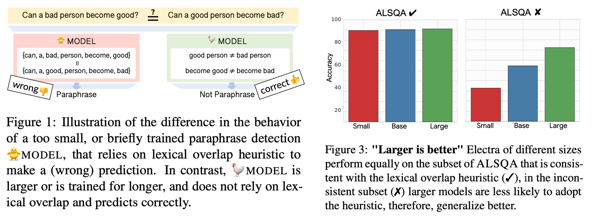

# Lexical Generalization Improves with Larger Models and Longer Training (EMNLP 2022)

## 1. Introduction
This repository contains the training and evaluation code and data used in the EMNLP 2022 paper "Lexical Generalization Improves with Larger Models and Longer Training"

> **_NOTE:_**  The evaluation test set presnted in the paper, ALSQA, can be found in 🤗 at https://huggingface.co/datasets/biu-nlp/alsqa.




## 2. Training
### Text Pair Classification
The finetuning of pretrained models for text-pair classification tasks was done with the code in 'train.py' modified from huggingface's finetuning [example](https://github.com/huggingface/transformers/blob/4bae96ec2bee265f938fc262201538819419089a/examples/text-classification/run_glue.py). The full hyper-parameters can be found in the table in the next section.

#### Finetuning examples

1. MNLI

    ```sh
    python train.py \
        --model_name_or_path [PRETRAINED_MODEL] \
        --task_name mnli \
        --do_train \
        --do_eval \
        --max_seq_length 512 \
        --per_device_train_batch_size [BATCH_SIZE] \
        --learning_rate [LR] \
        --num_train_epochs 6 \
        --output_dir ./outputs/ \
        --seed [SEED] \
        --lr_scheduler_type linear \
        --pad_to_max_len False 
    ```


2. PAWS

    ```bash
    python train.py \
        --model_name_or_path [PRETRAINED_MODEL] \
        --task_name qqp \
        --do_train \
        --do_eval \
        --max_seq_length 512 \
        --per_device_train_batch_size [BATCH_SIZE] \
        --learning_rate [LR] \
        --num_train_epochs 6 \
        --output_dir ./outputs/ \
        --seed [SEED] \
        --lr_scheduler_type linear \
        --pad_to_max_len False 
    ```


2. SQUAD (Answerability Only)

    ```bash
    python train.py \
        --model_name_or_path [PRETRAINED_MODEL] \
        --task_name squad2 \
        --do_train \
        --do_eval \
        --max_seq_length 512 \
        --per_device_train_batch_size [BATCH_SIZE] \
        --learning_rate [LR] \
        --num_train_epochs 6 \
        --output_dir ./outputs/ \
        --seed [SEED] \
        --lr_scheduler_type linear \
        --pad_to_max_len False 
    ```


#### Finetuning Hyper-Parameters


checkpoint | task | scheduller  | warmup pr | batch | lr |  epochs | seeds 
------------ | ------------ | ------------ | ------------ | ------------ | ------------ | ------------ | -------------
prajjwal1/bert-tiny | mnli | linear | 0.06 | 32 | 2e-5,3e-5 | 6 |  [1,...,6]*
prajjwal1/bert-mini | mnli | linear | 0.06 | 32 | 2e-5,3e-5 | 6 |  [1,...,6]*
prajjwal1/bert-medium | mnli | linear | 0.06 | 32 | 2e-5,3e-5 | 6 |  [1,...,6]*
bert-base-uncased | mnli | linear | 0.06 | 32 | 2e-5,3e-5 | 6 |  [1,...,6]*
bert-large-uncased | mnli | linear | 0.06 | 32 | 2e-5,3e-5 | 6 |  [1,...,6]*
roberta-base | mnli | linear | 0.06 | 32 | 2e-5,3e-5 | 6 |  [1,...,6]*
roberta-large | mnli | linear | 0.06 | 32 | 2e-5,3e-5 | 6 |  [1,...,6]*
roberta-base | qqp | linear | 0.06 | 32 | 2e-5,3e-5 | 6 |  [1,...,6]*
roberta-large | qqp | linear | 0.06 | 32 | 2e-5,3e-5 | 6 |  [1,...,6]*
electra-small | qqp | linear | 0.0 | 32 | 2e-5 | 6 | [1,...,6]
electra-base | qqp | linear | 0.0 | 32 | 2e-5 | 6 |  [1,...,6]
electra-large | qqp | linear | 0.0 | 32 | 2e-5 | 6 |  [1,...,6]
roberta-base | squad2 | linear | 0.06 | 32 | 2e-5,3e-5 | 6 |  [1,...,6]*
roberta-large | squad2 | linear | 0.06 | 32 | 2e-5,3e-5 | 6 |  [1,...,6]*
electra-small | squad2 | linear | 0.0 | 32 | 2e-5 | 6 | [1,...,6]
electra-base | squad2 | linear | 0.0 | 32 | 2e-5 | 6 |  [1,...,6]
electra-large | squad2 | linear | 0.0 | 32 | 2e-5 | 6 |  [1,...,6]

\* Where there are two learning rates the first half of the seeds were used in conjuction with the first learning rate etc, so every model were finetuned 6 times in total

### Reading Comprhension

The finetuning of pretrained models for text-pair classification tasks was done with [run_qa.py](https://github.com/huggingface/transformers/blob/4bae96ec2bee265f938fc262201538819419089a/examples/question-answering/run_qa.py) from huggingface's finetuning examples.

#### Finetuning Script

```bash
python train.py \
    --model_name_or_path [PRETRAINED_MODEL] \
    --dataset_name squad_v2 \
    --version_2_with_negative \
    --do_train \
    --do_eval \
    --max_seq_length 384 \
    --doc_stride 128 \
    --per_device_train_batch_size [BATCH_SIZE] \
    --learning_rate [LR] \
    --num_train_epochs 6 \
    --output_dir ./outputs/ \
    --seed [SEED] \
    --lr_scheduler_type linear \
    --pad_to_max_len False 
```


#### Finetuning Hyper-Parameters

checkpoint | task | scheduller  | warmup pr | batch | lr |  epochs | seeds 
------------ | ------------ | ------------ | ------------ | ------------ | ------------ | ------------ | -------------
roberta-base | squad2 | linear | 0.06 | 32 | 2e-5,3e-5 | 6 |  [1,...,6]
roberta-large | squad2 | linear | 0.06 | 32 | 2e-5,3e-5 | 6 |  [1,...,6]
electra-small | squad2 | linear | 0.0 | 32 | 2e-5 | 6 | [1,...,6]
electra-base | squad2 | linear | 0.0 | 32 | 2e-5 | 6 |  [1,...,6]
electra-large | squad2 | linear | 0.0 | 32 | 2e-5 | 6 |  [1,...,6]


## 3. Controlled Evaluation

In every example choose finetuned model from huggingface hub or path to local model and evaluate it.

1. HANS

    ```python
        from datasets import load_dataset
        from evaluation import evaluate_entailment_classification
    
        hans = load_dataset('hans', split='validation')
        dataset = hans.filter(lambda e: e['heuristic'] == 'lexical_overlap')
        
        evals = evaluate_entailment_classification(MNLI_MODEL_PATH, dataset)
    ```


2. PAWS-QQP
    
    First reconstruct the PAWS-QQP test set based on the instruction [here](https://github.com/google-research-datasets/paws), then save in the `data` folder under `paws_qqp_test.tsv`.

    ```python
        from datasets import load_dataset
        from evaluation import evaluate_paraphrase_detection
        
        dataset = load_dataset("csv", data_files="data\paws_qqp_test.tsv", delimiter='\t')['train']
        
        evals = evaluate_paraphrase_detection(QQP_MODEL_PATH, dataset)
    ```


    
3. ALSQA (For Answerability Classification Models)

    ```python
        from datasets import load_dataset
        from evaluation import evaluate_answerability_classification
        
        dataset = load_dataset('biu-nlp/alsqa', split='test')
        
        evals = evaluate_answerability_classification(ANSWERABILITY_MODEL_PATH, dataset)
    ```


    
4. ALSQA (For SQuAD2.0 Models)

    ```python
        from datasets import load_dataset
        from evaluation import evaluate_answerability_squad
        
        dataset = load_dataset('biu-nlp/alsqa', split='test')
        
        evals = evaluate_answerability_squad(SQUAD2_MODEL_PATH, dataset)
    ```
 
 
 ## Citation
 
 
```bib
# Lexical Generalization Improves with Larger Models and Longer Training (EMNLP 2022)

## 1. Introduction
This repository contains the training and evaluation code and data used in the EMNLP 2022 paper "Lexical Generalization Improves with Larger Models and Longer Training"

> **_NOTE:_**  The evaluation test set presnted in the paper, ALSQA, can be found in 🤗 at https://huggingface.co/datasets/biu-nlp/alsqa.


## 2. Training
### Text Pair Classification
The finetuning of pretrained models for text-pair classification tasks was done with the code in 'train.py' modified from huggingface's finetuning [example](https://github.com/huggingface/transformers/blob/4bae96ec2bee265f938fc262201538819419089a/examples/text-classification/run_glue.py). The full hyper-parameters can be found in the table in the next section.

#### Finetuning examples

1. MNLI

    ```sh
    python train.py \
        --model_name_or_path [PRETRAINED_MODEL] \
        --task_name mnli \
        --do_train \
        --do_eval \
        --max_seq_length 512 \
        --per_device_train_batch_size [BATCH_SIZE] \
        --learning_rate [LR] \
        --num_train_epochs 6 \
        --output_dir ./outputs/ \
        --seed [SEED] \
        --lr_scheduler_type linear \
        --pad_to_max_len False 
    ```


2. PAWS

    ```bash
    python train.py \
        --model_name_or_path [PRETRAINED_MODEL] \
        --task_name qqp \
        --do_train \
        --do_eval \
        --max_seq_length 512 \
        --per_device_train_batch_size [BATCH_SIZE] \
        --learning_rate [LR] \
        --num_train_epochs 6 \
        --output_dir ./outputs/ \
        --seed [SEED] \
        --lr_scheduler_type linear \
        --pad_to_max_len False 
    ```


2. SQUAD (Answerability Only)

    ```bash
    python train.py \
        --model_name_or_path [PRETRAINED_MODEL] \
        --task_name squad2 \
        --do_train \
        --do_eval \
        --max_seq_length 512 \
        --per_device_train_batch_size [BATCH_SIZE] \
        --learning_rate [LR] \
        --num_train_epochs 6 \
        --output_dir ./outputs/ \
        --seed [SEED] \
        --lr_scheduler_type linear \
        --pad_to_max_len False 
    ```


#### Finetuning Hyper-Parameters


checkpoint | task | scheduller  | warmup pr | batch | lr |  epochs | seeds 
------------ | ------------ | ------------ | ------------ | ------------ | ------------ | ------------ | -------------
prajjwal1/bert-tiny | mnli | linear | 0.06 | 32 | 2e-5,3e-5 | 6 |  [1,...,6]*
prajjwal1/bert-mini | mnli | linear | 0.06 | 32 | 2e-5,3e-5 | 6 |  [1,...,6]*
prajjwal1/bert-medium | mnli | linear | 0.06 | 32 | 2e-5,3e-5 | 6 |  [1,...,6]*
bert-base-uncased | mnli | linear | 0.06 | 32 | 2e-5,3e-5 | 6 |  [1,...,6]*
bert-large-uncased | mnli | linear | 0.06 | 32 | 2e-5,3e-5 | 6 |  [1,...,6]*
roberta-base | mnli | linear | 0.06 | 32 | 2e-5,3e-5 | 6 |  [1,...,6]*
roberta-large | mnli | linear | 0.06 | 32 | 2e-5,3e-5 | 6 |  [1,...,6]*
roberta-base | qqp | linear | 0.06 | 32 | 2e-5,3e-5 | 6 |  [1,...,6]*
roberta-large | qqp | linear | 0.06 | 32 | 2e-5,3e-5 | 6 |  [1,...,6]*
electra-small | qqp | linear | 0.0 | 32 | 2e-5 | 6 | [1,...,6]
electra-base | qqp | linear | 0.0 | 32 | 2e-5 | 6 |  [1,...,6]
electra-large | qqp | linear | 0.0 | 32 | 2e-5 | 6 |  [1,...,6]
roberta-base | squad2 | linear | 0.06 | 32 | 2e-5,3e-5 | 6 |  [1,...,6]*
roberta-large | squad2 | linear | 0.06 | 32 | 2e-5,3e-5 | 6 |  [1,...,6]*
electra-small | squad2 | linear | 0.0 | 32 | 2e-5 | 6 | [1,...,6]
electra-base | squad2 | linear | 0.0 | 32 | 2e-5 | 6 |  [1,...,6]
electra-large | squad2 | linear | 0.0 | 32 | 2e-5 | 6 |  [1,...,6]

\* Where there are two learning rates the first half of the seeds were used in conjuction with the first learning rate etc, so every model were finetuned 6 times in total

### Reading Comprhension

The finetuning of pretrained models for text-pair classification tasks was done with [run_qa.py](https://github.com/huggingface/transformers/blob/4bae96ec2bee265f938fc262201538819419089a/examples/question-answering/run_qa.py) from huggingface's finetuning examples.

#### Finetuning Script

```bash
python train.py \
    --model_name_or_path [PRETRAINED_MODEL] \
    --dataset_name squad_v2 \
    --version_2_with_negative \
    --do_train \
    --do_eval \
    --max_seq_length 384 \
    --doc_stride 128 \
    --per_device_train_batch_size [BATCH_SIZE] \
    --learning_rate [LR] \
    --num_train_epochs 6 \
    --output_dir ./outputs/ \
    --seed [SEED] \
    --lr_scheduler_type linear \
    --pad_to_max_len False 
```


#### Finetuning Hyper-Parameters

checkpoint | task | scheduller  | warmup pr | batch | lr |  epochs | seeds 
------------ | ------------ | ------------ | ------------ | ------------ | ------------ | ------------ | -------------
roberta-base | squad2 | linear | 0.06 | 32 | 2e-5,3e-5 | 6 |  [1,...,6]
roberta-large | squad2 | linear | 0.06 | 32 | 2e-5,3e-5 | 6 |  [1,...,6]
electra-small | squad2 | linear | 0.0 | 32 | 2e-5 | 6 | [1,...,6]
electra-base | squad2 | linear | 0.0 | 32 | 2e-5 | 6 |  [1,...,6]
electra-large | squad2 | linear | 0.0 | 32 | 2e-5 | 6 |  [1,...,6]


## 3. Controlled Evaluation

In every example choose finetuned model from huggingface hub or path to local model and evaluate it.

1. HANS

    ```python
        from datasets import load_dataset
        from evaluation import evaluate_entailment_classification
    
        hans = load_dataset('hans', split='validation')
        dataset = hans.filter(lambda e: e['heuristic'] == 'lexical_overlap')
        
        evals = evaluate_entailment_classification(MNLI_MODEL_PATH, dataset)
    ```


2. PAWS-QQP
    
    First reconstruct the PAWS-QQP test set based on the instruction [here](https://github.com/google-research-datasets/paws), then save in the `data` folder under `paws_qqp_test.tsv`.

    ```python
        from datasets import load_dataset
        from evaluation import evaluate_paraphrase_detection
        
        dataset = load_dataset("csv", data_files="data\paws_qqp_test.tsv", delimiter='\t')['train']
        
        evals = evaluate_paraphrase_detection(QQP_MODEL_PATH, dataset)
    ```


    
3. ALSQA (For Answerability Classification Models)

    ```python
        from datasets import load_dataset
        from evaluation import evaluate_answerability_classification
        
        dataset = load_dataset('biu-nlp/alsqa', split='test')
        
        evals = evaluate_answerability_classification(ANSWERABILITY_MODEL_PATH, dataset)
    ```


    
4. ALSQA (For SQuAD2.0 Models)

    ```python
        from datasets import load_dataset
        from evaluation import evaluate_answerability_squad
        
        dataset = load_dataset('biu-nlp/alsqa', split='test')
        
        evals = evaluate_answerability_squad(SQUAD2_MODEL_PATH, dataset)
    ```
 
 
 ## Citation
 
 
```bib
@inproceedings{bandel-etal-2022-lexical,
    title = "Lexical Generalization Improves with Larger Models and Longer Training",
    author = "Bandel, Elron  and
      Goldberg, Yoav  and
      Elazar, Yanai",
    booktitle = "Findings of the Association for Computational Linguistics: EMNLP 2022",
    month = dec,
    year = "2022",
    address = "Abu Dhabi, United Arab Emirates",
    publisher = "Association for Computational Linguistics",
    url = "https://aclanthology.org/2022.findings-emnlp.323",
    pages = "4398--4410",
    abstract = "While fine-tuned language models perform well on many language tasks, they were also shown to rely on superficial surface features such as lexical overlap. Excessive utilization of such heuristics can lead to failure on challenging inputs. We analyze the use of lexical overlap heuristics in natural language inference, paraphrase detection, and reading comprehension (using a novel contrastive dataset),and find that larger models are much less susceptible to adopting lexical overlap heuristics. We also find that longer training leads models to abandon lexical overlap heuristics. Finally, We provide evidence that the disparity between models size has its source in the pre-trained model.",
}
```
